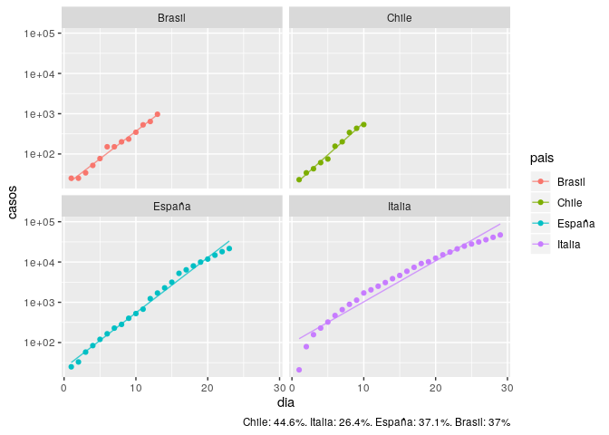

**NOTA**: Lo que presento aquí es un ejemplo de como realizar análisis
de series de tiempo, usando datos de la evolución total de casos
disponible en fuentes públicas en internet. No tiene ninguna validez
epidemiológica, ya que eso requería un modelo de la diseminación de la
enfermedad. En particular, las predicciones son solo válidas en cuanto
no existan cambios en las políticas públicas; si los hay, se esperaría
que (ojalá) las predicciones fuesen incorrectas.

-   **Informe día 20/03/2020**:
    <a href="https://rpubs.com/clbustos/587389" class="uri">https://rpubs.com/clbustos/587389</a>

Análisis de datos observados
----------------------------

Se utiliza una escala logarítmica, que permite mejor apreciar las
tendencias en los casos totales, además de partir en todos los países
con al menos 20 casos. Italia presenta una disminución constante de su
tasa de contagio, en tanto que España parece que no logrará disminuir la
tasa de contagio con respecto a Italia. Chile muestra una leve
disminución en su tasa, pasando de 46% de ayer 20 a 44.6%

    ## `geom_smooth()` using method = 'loess' and formula 'y ~ x'

Ajustando una regresión exponencial, esta representa bastante bien
todavía la situación de Chile, como la de Brasil. En el caso de Chile,
una tasa de 44.6% de aumento diario indicaría una duplicación de casos
cada 1.88 días.

Graficando la tasa de nuevos casos usando media móvil con ventana de 3
días, se observa con mayor claridad el estancamiento de España, así como
el aumento de la tasa de Brasil.

Predicción
----------

**NOTA**: Nuevamente, les recuerdo que aquí se presentan, como ejemplo,
dos metodologías para interpretar los datos. No tiene validez
epidemiologica. La explicación de cada método se encuentra en el informe
del día 20 de Marzo.

La disminución en la tasa de nuevos casos en Chile se ve reflejada en
una curva de tendencia + AR relativamente optimista, respecto al modelo
exponencial. Sin embargo, las quejas del Colegio Médico respecto a la
saturación de la capacidad diagnóstica hacen ser cautos con las
predicciones. Preocupa el caso de Brasil, donde el modelo AR tiende a
mostrar que deberían existir aun más casos que los que predice el modelo
exponencial.

A continuación, se presentan las predicciones para los próximos 7 días,
usando tendencia de datos nuevos + AR(1), que tiende a ser bastante
sensible a la evolución de los últimos días. Considerando lo breve de la
escala de tiempo, el intervalo de confianza se vuelve muy grande pasado
tres días para Chile y Brasil, no así para los países con línea de
tiempo mayores.

    ## $Chile
    ## 
    ## 
    ##       dia     casos       li          ls
    ## ---  ----  --------  -------  ----------
    ## 11     19    710.55   560.31     1829.25
    ## 12     20    881.32   571.54     4425.28
    ## 13     21   1094.17   578.00    11442.35
    ## 14     22   1315.37   580.78    29013.41
    ## 15     23   1555.61   581.90    80637.21
    ## 16     24   1796.96   582.27   238525.20
    ## 17     25   2036.53   582.38   775634.14
    ## 
    ## $Italia
    ## 
    ## 
    ##       dia      casos         li          ls
    ## ---  ----  ---------  ---------  ----------
    ## 30     36   52822.41   50189.12    57644.43
    ## 31     37   59242.52   53533.60    69968.55
    ## 32     38   66055.31   56945.06    83573.94
    ## 33     39   73302.17   60425.03    98665.15
    ## 34     40   80942.66   63933.42   115304.44
    ## 35     41   88949.87   67439.25   133592.70
    ## 36     42   97285.09   70909.30   153614.25
    ## 
    ## $España
    ## 
    ## 
    ##       dia      casos         li          ls
    ## ---  ----  ---------  ---------  ----------
    ## 24     36   26275.01   23229.11    34916.18
    ## 25     37   31760.61   25004.31    51867.38
    ## 26     38   38037.78   26853.94    73170.47
    ## 27     39   45134.74   28741.55    99853.33
    ## 28     40   53065.46   30629.62   133165.77
    ## 29     41   61825.28   32481.04   174611.96
    ## 30     42   71388.82   34261.10   225993.18
    ## 
    ## $Brasil
    ## 
    ## 
    ##       dia      casos       li             ls
    ## ---  ----  ---------  -------  -------------
    ## 14     26    1323.99   972.48   5.143128e+04
    ## 15     27    1899.43   973.90   2.855324e+05
    ## 16     28    2733.73   974.56   1.343639e+06
    ## 17     29    3983.54   974.83   7.091728e+06
    ## 18     30    5840.67   974.92   4.315675e+07
    ## 19     31    8609.05   974.95   3.069385e+08
    ## 20     32   12736.09   974.96   2.545747e+09

Ahora, la predicción por método exponencial, que tiende a funcionar bien
para procesos sin cambios recientes.

    ## $Chile
    ## 
    ## 
    ##       dia     casos        li         ls
    ## ---  ----  --------  --------  ---------
    ## 11     19    869.99    605.22    1250.57
    ## 12     20   1258.05    859.95    1840.46
    ## 13     21   1819.22   1219.49    2713.88
    ## 14     22   2630.70   1726.46    4008.54
    ## 15     23   3804.15   2440.66    5929.36
    ## 16     24   5501.03   3446.07    8781.41
    ## 17     25   7954.82   4860.52   13019.01
    ## 
    ## $Italia
    ## 
    ## 
    ##       dia      casos          li          ls
    ## ---  ----  ---------  ----------  ----------
    ## 30     36   111274.9    37919.39    326537.3
    ## 31     37   140651.8    47588.59    415707.2
    ## 32     38   177784.2    59698.89    529444.3
    ## 33     39   224719.8    74860.96    674570.5
    ## 34     40   284046.5    93836.94    859815.1
    ## 35     41   359035.6   117577.86   1096350.9
    ## 36     42   453822.1   147270.02   1398482.2
    ## 
    ## $España
    ## 
    ## 
    ##       dia       casos          li          ls
    ## ---  ----  ----------  ----------  ----------
    ## 24     36    45474.78    29077.24    71119.39
    ## 25     37    62352.96    39685.05    97968.66
    ## 26     38    85495.56    54145.54   134997.09
    ## 27     39   117227.64    73852.43   186078.10
    ## 28     40   160737.24   100701.92   256563.73
    ## 29     41   220395.63   137273.31   353850.52
    ## 30     42   302196.51   187074.44   488162.53
    ## 
    ## $Brasil
    ## 
    ## 
    ##       dia     casos        li         ls
    ## ---  ----  --------  --------  ---------
    ## 14     26   1295.79    877.12    1914.29
    ## 15     27   1775.58   1187.84    2654.15
    ## 16     28   2433.03   1606.74    3684.25
    ## 17     29   3333.91   2171.08    5119.57
    ## 18     30   4568.37   2930.81    7120.90
    ## 19     31   6259.91   3952.96    9913.17
    ## 20     32   8577.77   5327.46   13811.12

Fuentes de información:

-   Chile:
    <a href="https://www.minsal.cl/nuevo-coronavirus-2019-ncov/casos-confirmados-en-chile-covid-19/" class="uri">https://www.minsal.cl/nuevo-coronavirus-2019-ncov/casos-confirmados-en-chile-covid-19/</a>.
-   Otros países:
    <a href="https://www.worldometers.info/coronavirus/#countries" class="uri">https://www.worldometers.info/coronavirus/#countries</a>
-   Presidenta del Colegio Médico golpea la mesa y acusa “total falta de
    transparencia” en el manejo del Gobierno en la crisis del
    coronavirus:
    <a href="https://www.elmostrador.cl/noticias/pais/2020/03/20/presidenta-del-colegio-medico-golpea-la-mesa-y-acusa-total-falta-de-transparencia-en-el-manejo-del-gobierno-en-la-crisis-del-coronavirus/" class="uri">https://www.elmostrador.cl/noticias/pais/2020/03/20/presidenta-del-colegio-medico-golpea-la-mesa-y-acusa-total-falta-de-transparencia-en-el-manejo-del-gobierno-en-la-crisis-del-coronavirus/</a>
